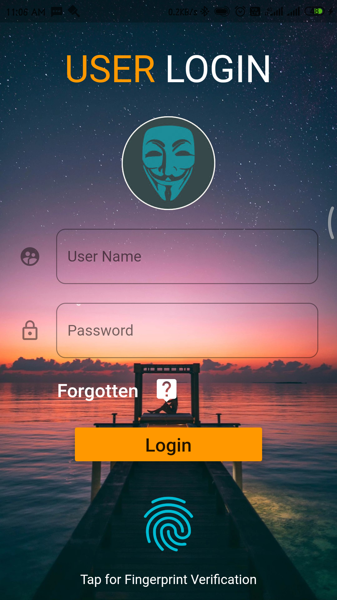
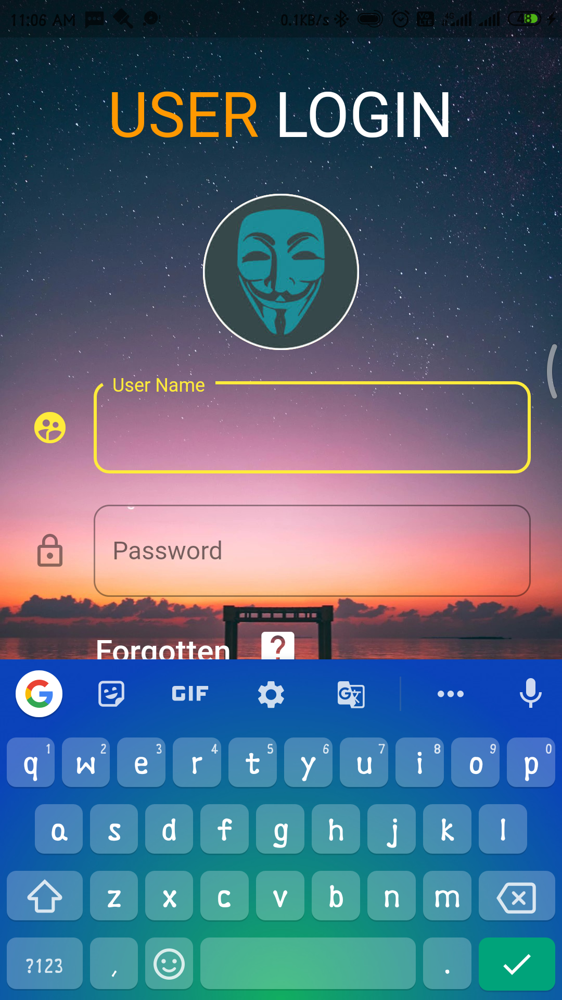
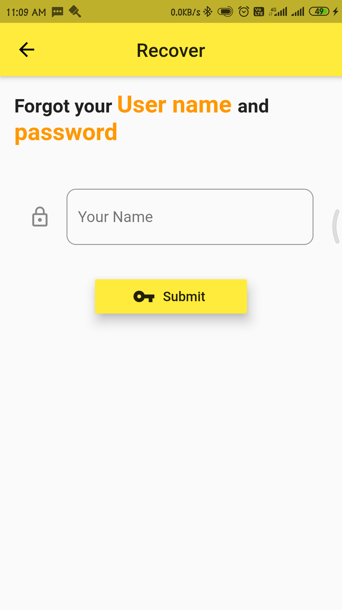
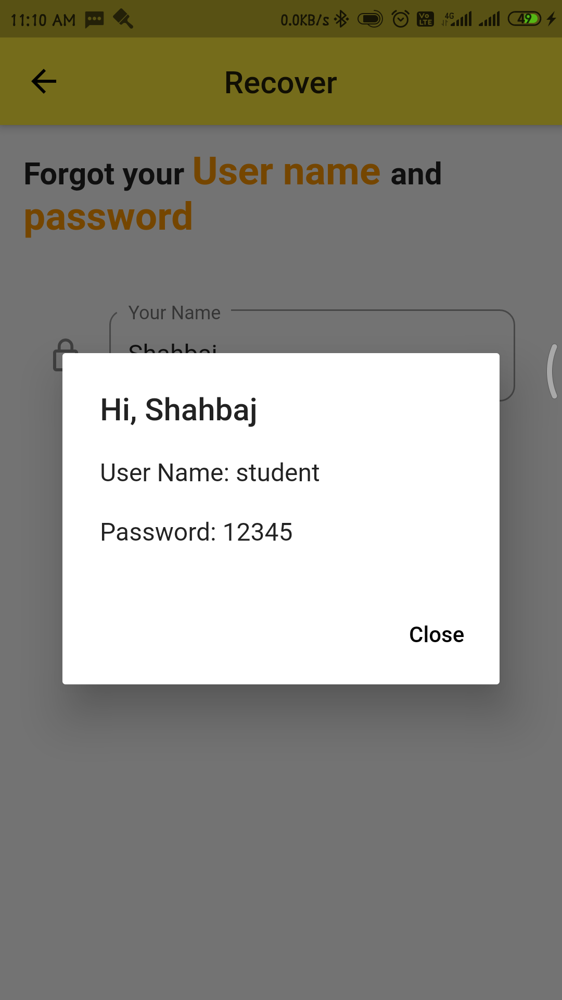
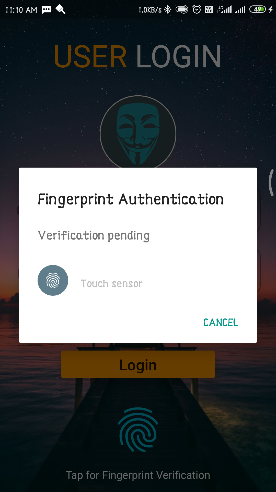

# loging_page

Login App build with Flutter

User Name - 'student'

Password - '12345'

#### Features
- [x] Login with User_Name & Password
- [x] Recovery of User_Name & Password
- [x] Login With FingerPrint


## Getting Started

This project is a starting point for a Flutter application.

A few resources to get you started if this is your first Flutter project:

### Screenshots
***
          

***
# Project Created
### Shahbaj Jamil
 #Flutter, #Android Developer.
 
<a href="https://www.instagram.com/shahbaj_jamil"></a>   <a href="https://www.facebook.com/shahbaj.jamil"></a>   <a href="https://twitter.com/JamilShahbaj"></a>

# License
```
 Copyright 2020 Shahbaj Jamil

   Licensed under the Apache License, Version 2.0 (the "License");
   you may not use this file except in compliance with the License.
   You may obtain a copy of the License at

       http://www.apache.org/licenses/LICENSE-2.0

   Unless required by applicable law or agreed to in writing, software
   distributed under the License is distributed on an "AS IS" BASIS,
   WITHOUT WARRANTIES OR CONDITIONS OF ANY KIND, either express or implied.
   See the License for the specific language governing permissions and
   limitations under the License.
```

- [Lab: Write your first Flutter app](https://flutter.dev/docs/get-started/codelab)
- [Cookbook: Useful Flutter samples](https://flutter.dev/docs/cookbook)

For help getting started with Flutter, view our
[online documentation](https://flutter.dev/docs), which offers tutorials,
samples, guidance on mobile development, and a full API reference.
